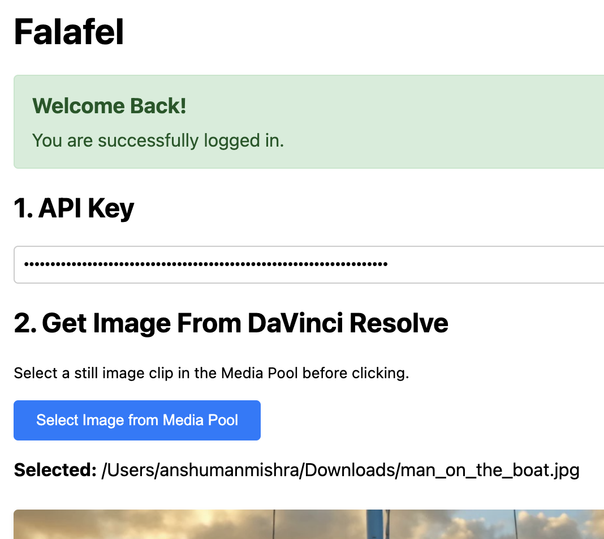
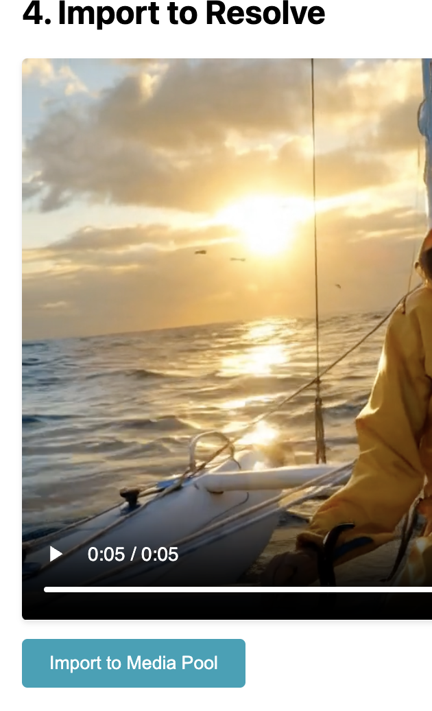

I'm super excited to announce the launch of **Falafel**, a new tool designed to bridge the gap between powerful AI video generation and professional video editing.

If you've ever wanted to generate stunning video clips from an image using diffusion models and bring them directly into your DaVinci Resolve timeline without a cumbersome export/import process, Falafel is for you.

### What is Falafel?

Falafel is a free, open-source desktop application that acts as a bridge between your DaVinci Resolve media pool and the powerful models available on [Fal.ai](https://fal.ai). It streamlines the creative process, letting you focus on editing, not file management.

The name 'Falafel' is a fun nod to its core—it's a wrapper for **Fal** AI. The project is built with Electron and the source code is available for everyone on [GitHub](https://github.com/kanpuriyanawab/falafel).

### How It Works

Getting started is simple. The entire workflow is designed to keep you in your creative zone.

1.  **Install & Setup**
    Download and install the Falafel desktop app. On the first launch, you'll be prompted to sign in with Google to get started.

2.  **Connect to DaVinci Resolve**
    Inside Resolve, navigate to the menu: `Workspace` -> `Scripts` -> `Falafel`. This action starts a local server that allows the two applications to communicate.

3.  **Select Your Source Image**
    In the DaVinci Resolve Media Pool, simply click on the image you want to use as your source.

4.  **Generate in Falafel**
    Switch over to the Falafel app.
    * Click the **`Select Image from Media Pool`** button. Your chosen image will appear in the app.
    * Enter your Fal AI API Key.
    * Write a descriptive prompt for the video you want to create.
    * Click **`Generate Video`** and let the AI work its magic.

5.  **Import to Resolve**
    Once the generation is complete, a new button, **`Import to Media Pool`**, will appear in Falafel. Clicking this will send the newly created video file directly into your DaVinci Resolve Media Pool, ready to be dropped into your timeline.

### Key Features

* **Seamless Integration**: A direct link between your Resolve project and AI models. No more saving, exporting, finding, and importing files.
* **Privacy-Focused**: Your API keys are yours alone and are not stored or transmitted to any third-party server besides Fal.ai.
* **Open Source**: Built for the community, by the community. You can inspect the code, contribute, and suggest features on [GitHub](https://github.com/kanpuriyanawab/falafel).
* **Free to Use**: Falafel is completely free. You only need an API key from Fal.ai for the generation service itself.

### Get Started Now

Ready to supercharge your editing workflow? You can download the latest version of Falafel and find the source code on the official GitHub repository.

**[Download Falafel](https://github.com/kanpuriyanawab/falafel/releases/tag/v1.0.0)**

### The Road Ahead

This is just the beginning for Falafel. Future plans include support for more models, batch processing, and even more configuration options directly within the app.

I built Falafel to solve a problem I had, and I hope it helps you too. I welcome any feedback, bug reports, and contributions. Please feel free to open an issue or pull request on GitHub.

Thank you for checking it out!