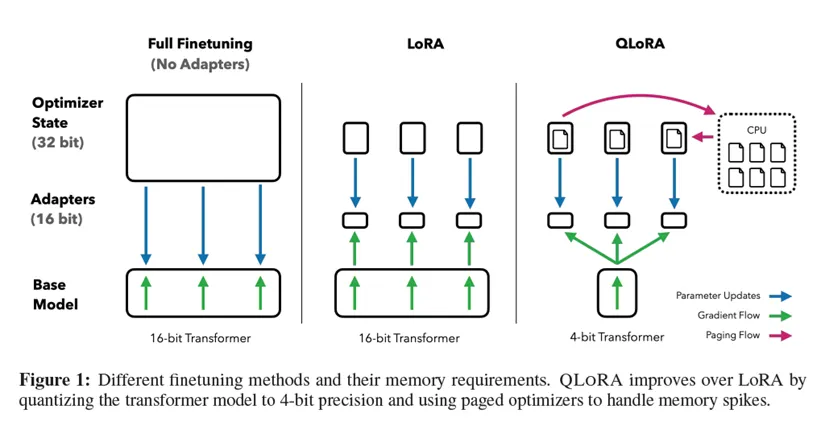
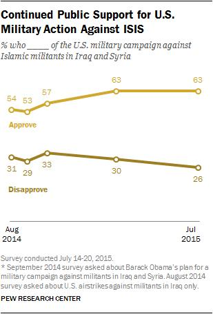

**"Keep it simple"** they said. 

When I was working on an agentic pipeline for a question-answering task on a time-series dataset, the common advice was to just dump the raw data into the language model's context. In my opinion, that was a flawed approach. Dumping a stream of floating-point numbers into a prompt is a recipe for confusing the model and getting unreliable results.

So, in this tutorial, we'll explore a more robust alternative. We will fine-tune a Vision Language Model (VLM), specifically Google's Gemma 3, for a Visual Question Answering (VQA) task on chart data. We'll be using the powerful Hugging Face ecosystem, including `transformers`, `datasets`, and `trl`.

## Install dependencies


First thing first let's get the base libraries, and we are going to do this guide in pytorch. To install it:

```bash
!pip install -qq torch torchvision torchaudio
```

Next, we'll need transformers for our models, datasets for data handling, bitsandbytes for quantization, peft for efficient fine-tuning, and accelerate to optimize it all.

```bash
!pip install -U -qq transformers trl datasets bitsandbytes peft accelerate
```

::: {.callout-tip title="Key Libraries"}
- **`transformers`**: Provides the VLM architecture (Gemma 3) and processor.
- **`datasets`**: Allows us to easily load and manipulate the ChartQA dataset.
- **`bitsandbytes`**: Enables model quantization (like 4-bit loading) to reduce memory usage.
- **`peft`**: The Parameter-Efficient Fine-Tuning library, which contains the logic for LoRA/QLoRA.
- **`trl`**: The Transformer Reinforcement Learning library, which simplifies the supervised fine-tuning process with its `SFTTrainer`.
:::

## Load and Prepare the Dataset

With our environment set up, it's time to load our data. The [ChartQA dataset](https://huggingface.co/datasets/HuggingFaceM4/ChartQA) is available on the Hugging Face Hub and is perfect for our task. It contains a wide variety of graphs along with corresponding question-answer pairs, presenting a solid challenge for a model's VQA capabilities.

Since our goal is to build a conversational model, we need to format the dataset into a chat-like structure. I've crafted a system prompt to guide the model's behavior:


```python
system_prompt="""You are a Vision Language Model that understands and 
interprets chart images. Your job is to look at the chart and answer 
questions with short, clear responses—usually a single word, number, 
or brief phrase. The charts may be line charts, bar charts, pie charts, 
or others, and can include colors, labels, legends, and text. Focus on 
giving accurate answers based only on what is shown  in the image. 
Do not explain your answer unless the question needs it to make sense.
"""
```

Referring to the chat template described in the [Gemma 3 model card](https://huggingface.co/google/gemma-3-4b-it), we can create a formatting function that structures each sample into a conversation with `system`, `user`, and `assistant` roles.
 

```javascript
def format_data(sample):
    # The system message sets the context for the model
    system_message = {
        "role": "system",
        "content": [{"type": "text", "text": system_prompt}],
    }
    # The user message provides the image and the question
    user_message = {
        "role": "user",
        "content": [
            {"type": "image", "image": sample["image"]},
            {"type": "text", "text": sample["query"]},
        ],
    }
    # The assistant message provides the ground-truth answer
    assistant_message = {
        "role": "assistant",
        "content": [{"type": "text", "text": sample["label"][0]}],
    }
    return [system_message, user_message, assistant_message]
```
::: {.callout-note title="Note"}

This guide is compute-intensive, so we'll only use a small fraction (10%) of the dataset for demonstration. For a production model, you would want to fine-tune on the full dataset.

:::

```javascript
from datasets import load_dataset

train_dataset, eval_dataset, test_dataset = load_dataset(
    "HuggingFaceM4/ChartQA", 
    split=["train[:10%]", "val[:10%]", "test[:10%]"]
)

```

Now, let’s format the data using the chatbot structure.

```javascript
train_dataset = [format_data(sample) for sample in train_dataset]
eval_dataset = [format_data(sample) for sample in eval_dataset]
test_dataset = [format_data(sample) for sample in test_dataset]
```

## Establish a Baseline

Before fine-tuning, let's load the base model and test its performance out-of-the-box. This will give us a baseline to measure our improvements against.

We'll load the `gemma-3-4b-it` model, which is the instruction-tuned version of Gemma 3 with 4 billion parameters.

](./assets/finetune_vlm/gemma3_arch.png)

```javascript
import torch
from transformers import AutoProcessor, Gemma3ForConditionalGeneration

model = Gemma3ForConditionalGeneration.from_pretrained(
    "google/gemma-3-4b-it",
    device_map="auto",
    torch_dtype=torch.bfloat16
)
processor = AutoProcessor.from_pretrained("google/gemma-3-4b-it")
```

Next, let's create a helper function to streamline inference. This function will take a data sample, process it, and generate the model's response.

```javascript

def generate_text_from_sample(model, processor, sample, max_new_tokens=1024, device="cuda"):
    # The sample contains system, user, and assistant messages.
    # We only need the user message for inference.
    chat_for_inference = sample[1:2] 
    
    # Prepare the text prompt by applying the chat template
    text_input = processor.apply_chat_template(
        chat_for_inference, 
        add_generation_prompt=True,
        tokenize=False
    )

    # Prepare the image input
    image = sample[1]["content"][0]["image"]
    if image.mode != "RGB":
        image = image.convert("RGB")

    # Process both text and image
    inputs = processor(
        text=text_input,
        images=[image],
        return_tensors="pt",
    ).to(device)

    # Generate an answer
    generated_ids = model.generate(**inputs, max_new_tokens=max_new_tokens)

    # Decode the generated tokens into text
    output_text = processor.batch_decode(
        generated_ids, skip_special_tokens=True, clean_up_tokenization_spaces=False
    )

    return output_text[0]
```

Let's test the base model on a sample from our training set.

```python
output = generate_text_from_sample(model, processor, train_dataset[0])
print(output)
```
::: {.callout-note title="Note"}

The output will vary, but it's often incorrect or generic.

:::


A model with four billion parameters is still too large to fine-tune directly on most consumer hardware. To solve this, we'll use **QLoRA (Quantized Low-Rank Adaptation)**, a highly efficient fine-tuning technique.

### What is QLoRA?

QLoRA reduces the memory footprint of fine-tuning by combining two powerful ideas:

1.  **Quantization**: The main model weights are loaded in a 4-bit data type, drastically cutting down memory usage.
2.  **Low-Rank Adaptation (LoRA)**: Instead of training all the model's billions of parameters, we only train a small number of "adapter" matrices that are injected into the model's architecture.

This combination allows us to fine-tune massive models on a single GPU without sacrificing much performance.



### Loading the Quantized Model

First, we'll create a `BitsAndBytesConfig` to tell the `transformers` library to load our model in 4-bit precision.


```javascript
from transformers import BitsAndBytesConfig

bits_and_bytes_config = BitsAndBytesConfig(
    load_in_4bit=True,
    bnb_4bit_use_double_quant=True,
    bnb_4bit_quant_type="nf4",
    bnb_4bit_compute_dtype=torch.bfloat16
)

model = Gemma3ForConditionalGeneration.from_pretrained(
    "google/gemma-3-4b-it",
    device_map="auto",
    torch_dtype=torch.bfloat16,
    quantization_config=bits_and_bytes_config
)
processor = AutoProcessor.from_pretrained("google/gemma-3-4b-it")
```

::: {.callout-tip title="Key Parameters in `BitsAndBytesConfig`"}
-   **`load_in_4bit=True`**: The master switch that enables 4-bit quantization.
-   **`bnb_4bit_quant_type="nf4"`**: Specifies the quantization type. "nf4" (NormalFloat 4-bit) is a sophisticated data type optimized for normally distributed weights, which is common in neural networks.
-   **`bnb_4bit_use_double_quant=True`**: Applies a second quantization after the first one, further reducing the memory footprint.
-   **`bnb_4bit_compute_dtype=torch.bfloat16`**: While the model weights are stored in 4-bit, computations (like matrix multiplications) are performed in a higher-precision format (`bfloat16`) to maintain accuracy and stability.
:::


### Setting Up the LoRA Configuration

Next, we define our `LoraConfig`. This tells PEFT where to inject the adapter layers and how to configure them.

```javascript

from peft import LoraConfig, get_peft_model

peft_config = LoraConfig(
    lora_alpha=16,
    lora_dropout=0.05,
    r=8,
    bias="none",
    target_module=['q_proj', 'v_proj'],
    task_type="CAUSAL_LM"
)

peft_model = get_peft_model(model, peft_config)
```

::: {.callout-tip title="Key Parameters in `LoraConfig`"}
-   **`r`**: The rank of the low-rank matrices. A smaller `r` means fewer trainable parameters and faster training, but might capture less information. `8` is a common starting point.
-   **`lora_alpha`**: A scaling factor for the LoRA weights. It's often set to twice the value of `r`.
-   **`target_modules`**: A crucial parameter that specifies which layers of the base model will be adapted. For vision-language models, targeting the query (`q_proj`) and value (`v_proj`) projections in the attention mechanism is a common and effective strategy.
-   **`task_type="CAUSAL_LM"`**: Informs PEFT about the task type, ensuring the adapters are set up correctly for a causal language model.
:::


### Configuring the Trainer

Now, we configure the training process using `SFTConfig` from the TRL library. This class holds all the hyperparameters for our supervised fine-tuning run.

```javascript

from trl import SFTConfig

# Configure training arguments
training_args = SFTConfig(
    output_dir="gemma3-vqa-finetuned",
    num_train_epochs=3,
    per_device_train_batch_size=4,
    per_device_eval_batch_size=4,
    gradient_accumulation_steps=8,
    gradient_checkpointing=True, 

    # Optimizer and scheduler settings
    optim="adamw_torch_fused", 
    learning_rate=2e-4,
    lr_scheduler_type="constant",

    # Logging and evaluation
    logging_steps=10,
    eval_steps=10,
    eval_strategy="steps",
    save_strategy="steps",
    save_steps=20,
    metric_for_best_model="eval_loss",
    greater_is_better=False,
    load_best_model_at_end=True,

    # Mixed precision and gradient settings
    bf16=True,
    tf32=True,
    max_grad_norm=0.3,
    warmup_ratio=0.03,

    # Hub and reporting
    push_to_hub=True,
    report_to="wandb",

    # Gradient checkpointing settings
    gradient_checkpointing_kwargs={"use_reentrant": False},  

    # Dataset configuration
    dataset_text_field="",  # Text field in dataset
    dataset_kwargs={"skip_prepare_dataset": True}
)

training_args.remove_unused_columns = False

```

::: {.callout-tip title="Key Parameters in `SFTConfig`"}
-   **`output_dir`**: The directory where training checkpoints and the final adapter model will be saved.
-   **`per_device_train_batch_size`**: The number of samples processed per GPU in each training step.
-   **`gradient_accumulation_steps`**: A memory-saving technique. Gradients are accumulated for this many steps before an optimizer update is performed. This allows you to simulate a larger batch size (`4 * 8 = 32` here) without using more GPU memory.
-   **`optim`**: The optimizer to use. `adamw_torch_fused` is a memory-efficient and fast version of the AdamW optimizer.
-   **`eval_strategy="steps"`**: Specifies that evaluation should be run at regular step intervals.
-   **`bf16=True`**: Enables mixed-precision training, which speeds up computation and reduces memory usage by performing certain operations in `bfloat16`.
-   **`gradient_checkpointing`**: Another key memory-saving technique that trades more compute time for a significantly smaller memory footprint during the backward pass.
:::


### Creating a Data Collator

We need one final piece before training: a data collator. This function takes a list of samples from our dataset and batches them together, ensuring they are correctly padded and formatted for the model. It's also responsible for creating the `labels` for our language modeling task.

```javascript
image_token_id = processor.tokenizer.additional_special_tokens_ids[
    processor.tokenizer.additional_special_tokens.index("<image>")
]


def collate_fn(examples):
    # Each 'example' is a list of dicts (system, user, assistant)
    texts = [processor.apply_chat_template(ex, tokenize=False) for ex in examples]
    images = [ex[1]["content"][0]["image"] for ex in examples]
    
    # Process the batch
    batch = processor(text=texts, images=images, return_tensors="pt", padding=True)

    # Create labels for language modeling
    labels = batch["input_ids"].clone()
    # Mask padding tokens and image tokens so they are not included in the loss calculation
    labels[labels == processor.tokenizer.pad_token_id] = -100
    labels[labels == image_token_id] = -100
    batch["labels"] = labels

    return batch
```
::: {.callout-tip title="What is a Data Collator?"}
A data collator is a function that takes a list of individual dataset items and bundles them into a single batch. Its key responsibilities are:

-   **Batching**: Combining multiple samples into tensors.
-   **Padding**: Making sure all sequences in the batch have the same length by adding padding tokens.
-   **Label Creation**: For language modeling, it creates the `labels` tensor that the model uses to calculate loss. In our case, we mask out the input prompt, padding tokens, and image tokens, so the model is only trained to predict the assistant's response.
:::

### Launching the Training

Now, we can instantiate the `SFTTrainer` from TRL. It elegantly wraps the entire training loop, handling everything from data collation to model saving.

```javascript

from trl import SFTTrainer

trainer = SFTTrainer(
    model=model,
    args=training_args,
    train_dataset=train_dataset,
    eval_dataset=eval_dataset,
    data_collator=collate_fn,
    peft_config=peft_config,
    processing_class=processor.tokenizer,
)
```


::: {.callout-tip title="Why pass `model` and `peft_config` separately?"}
The `SFTTrainer` is smart. Instead of requiring you to wrap the model with `get_peft_model` yourself, it handles it internally. You provide the base (quantized) model and the `peft_config`, and the trainer sets up the PEFT model for you.
:::

To start training, all we need to do is call one method:

```python
trainer.train()
```

This will kick off the training process, and once training is complete, the best adapter checkpoint will be saved in the `output_dir` we specified.


## Test the Fine-Tuned Model

We're done! Now for the moment of truth. Let's load our fine-tuned adapter and see if the model's performance has improved.

First, we reload the original 4-bit quantized model. Then, we use the `load_adapter` method to attach our trained LoRA weights.


```javascript
model = Gemma3ForConditionalGeneration.from_pretrained(
    "google/gemma-3-4b-it",
    device_map="auto",
    torch_dtype=torch.bfloat16,
    quantization_config=bits_and_bytes_config
)

model.load_adapter("gemma3-vqa-finetuned")

```

Let's pick a sample from the test set that the model hasn't seen before.

```python
test_sample = test_dataset[21]
print("Question:", test_sample[1]['content'][1]['text'])
test_sample[1]['content'][0]['image']
```



And now, let's generate an answer with our fine-tuned model.

```python
output = generate_text_from_sample(model, processor, test_sample)
print("Model Answer:", output)
```

You should now see a much more accurate and direct answer to the question, demonstrating the power of fine-tuning. We've successfully taught the model a new skill—interpreting charts—without the prohibitive cost of a full fine-tune.

## References

1. [Finetuning Qwen2 VL with Huggingface](https://huggingface.co/learn/cookbook/en/fine_tuning_vlm_trl)
2.  [QLoRA Blog Post (Hugging Face)](https://huggingface.co/blog/4bit-transformers-bitsandbytes)