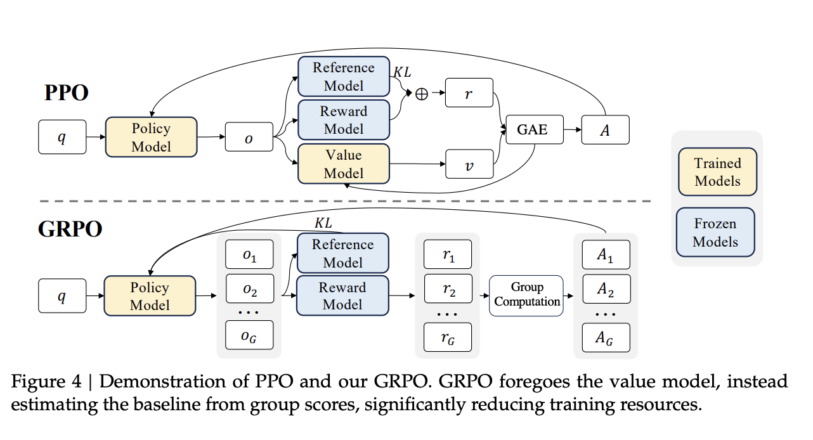

It's been a while since I wrote a blog on slightly technical topic. Today is the day!

It's 2025 and LLMs have gained ability to "reason" their way through a tricky math problems. It's not magic—it's the result of specialized post-training. While pre-trained LLMs are incredibly knowledgeable, they aren't born problem-solvers. To get them to excel at complex tasks like mathematical reasoning, we need to fine-tune them.

In this guide, we'll learn how to do just that. We're going to take a powerful base model, `Qwen3-1.7B-Base`, and teach it to reason using a clever RL technique called GRPO and the speed-boosting Unsloth library. Let's get started!

::: {.callout-note title="Base Model vs. Chat Model"}

#### What's a Base Model?
A base model is the raw, foundational LLM that has been trained on a massive corpus of text data. Its core capability is simply predicting the next word. It's incredibly knowledgeable but doesn't inherently know how to follow instructions or engage in a conversation. Think of it as a brilliant but untamed engine of knowledge.

#### What's a Chat/Instruct Model?
A chat model (or instruction-tuned model) is a base model that has undergone a second stage of training. This alignment phase, often using techniques like Supervised Fine-Tuning (SFT) and Reinforcement Learning from Human Feedback (RLHF), teaches the model to be helpful, harmless, and follow user instructions in a conversational format. This process gives the model a specific "personality" and a strong bias towards a certain style of response.

:::


### **What is GRPO and How Does It Work?**

**Group Relative Policy Optimization (GRPO)** is an advanced reinforcement learning (RL) technique designed to efficiently enhance a language model's reasoning capabilities. To understand its benefits, we first need to look at the method it improves upon: Proximal Policy Optimization (PPO).


::: {.callout-warning title="Problem with PPO"}
Traditional RL fine-tuning with PPO is notoriously expensive because it requires loading four large models into GPU memory: a **Policy Model** (the one being trained), a **Reference Model**, a **Reward Model**, and a **Value Model**. The Value Model, which is also trainable, estimates the potential for long-term rewards but adds significant complexity and memory overhead.
:::




GRPO **completely removes the need for the Value Model**. This single change significantly cuts down computational requirements, making advanced RL fine-tuning more accessible.

It simply replaces the complex value estimation with a clever, three-step process based on group statistics:

1.  **Generate a Group of Outputs**: Instead of creating a single response, the policy model is prompted to generate a *group* of varied responses for a given prompt.

2.  **Calculate Rewards**: Each of these generated outputs is then scored by a reward function (or a separate Reward Model). For a reasoning task, rewards might be based on correct formatting or mathematical accuracy.

3.  **Estimate Advantage from the Group**: This is the key step. GRPO calculates the "advantage" for each response—a signal telling the model whether to reinforce or discourage that type of output. It does this by normalizing each response's reward against the mean and standard deviation of the entire group's rewards.

The advantage is calculated with a simple formula that essentially asks, "How good is this response compared to the average of all other responses in this group?"

::: {.callout-tip title="Calculating the Advantage" collapse="true"}
The advantage is calculated with this simple formula:

$$
\hat{A}_{i,t} = \frac{r_i - \text{mean}(r)}{\text{std}(r)}
$$

Where:
- $r_i$ is the reward for a specific output.
- $\text{mean}(r)$ is the average reward of all outputs in the group.
- $\text{std}(r)$ is the standard deviation of all rewards.

This formula essentially asks, "How good or bad is this specific response compared to the average of all responses the model just generated for this prompt?". An output with a reward far above the average gets a high positive advantage, strongly reinforcing that reasoning path. An output below the average gets a negative advantage, penalizing it. This group-based comparison provides a robust, on-the-fly baseline without needing a separate, memory-hungry Value LLM.
:::

::: {.callout-note title="A Simple Example on Advantage calculation in GRPO" collapse="true"}
Imagine the prompt is "What is 7 * 6?". The model generates a group of 3 responses that are then scored:

| Response                                                                 | Reason                          | Reward |
| ------------------------------------------------------------------------ | ------------------------------- | :----: |
| `<think>7*6 is 42</think><SOLUTION>42</SOLUTION>` | Correct format & answer         | **+4.0** |
| `<think>7*6 is 41</think><SOLUTION>41</SOLUTION>` | Correct format, wrong answer    | **+1.0** |
| `The answer is 42.`                                                      | Wrong format, "correct" answer  | **-2.0** |

GRPO then calculates the group's statistics:

-   **Mean reward:** `(4.0 + 1.0 - 2.0) / 3 = 1.0`

-   **Advantage for Response A:** `(4.0 - 1.0) / std_dev` = High positive value (Strongly reinforce!)

-   **Advantage for Response C:** `(-2.0 - 1.0) / std_dev` = High negative value (Strongly penalize!)

This process allows the model to learn to prefer the structure and accuracy of Response A without needing a separate Value Model to make that judgment.
:::

This group-based comparison provides a robust, on-the-fly baseline that effectively guides the model toward better reasoning.

## Why Use Unsloth?


**[Unsloth](https://unsloth.ai/)** is a powerful library designed to make fine-tuning LLMs faster and more memory-efficient. It achieves this through several optimizations, including:

* **Faster training:** Unsloth can significantly speed up the training process, in some cases by a factor of 2x or more.
* **Reduced memory usage:** It allows for fine-tuning larger models on consumer-grade hardware by reducing the memory footprint.
* **Ease of use:** Unsloth provides a user-friendly API that simplifies the fine-tuning workflow.

Now, let's dive into the code and the fine-tuning process.

---


## The Post Training Process

### 1. Setting Up the Environment

The first step is to install the necessary libraries. The script provides commands for both a standard Python environment and a Google Colab instance.

::: {.panel-tabset}

#### Standard Environment


```python
# For a standard environment
!pip install unsloth vllm
```

#### Google Colab


```python
!pip install --no-deps unsloth vllm==0.8.5.post1
!pip install --no-deps bitsandbytes accelerate xformers==0.0.29.post3 peft trl triton cut_cross_entropy unsloth_zoo
!pip install sentencepiece protobuf "datasets>=3.4.1,<4.0.0>" "huggingface_hub>=0.34.0" hf_transfer
```
:::

These commands install Unsloth for post-training, vLLM for fast inference, and other essential libraries like PEFT (Parameter-Efficient Fine-Tuning), TRL (Transformer Reinforcement Learning), and Datasets.

### 2. Loading the Model and Preparing for PEFT
Next, we load the Qwen3-1.7B-Base model using Unsloth's `FastLanguageModel`. We also configure it for PEFT using LoRA (Low-Rank Adaptation).

```python
from unsloth import FastLanguageModel
import torch

max_seq_length = 2048
lora_rank = 32

model, tokenizer = FastLanguageModel.from_pretrained(
    model_name = "unsloth/Qwen3-1.7B-Base",
    max_seq_length = max_seq_length,
    load_in_4bit = False, # False for LoRA 16bit
    fast_inference = True, # Enable vLLM fast inference
    max_lora_rank = lora_rank,
    gpu_memory_utilization = 0.7, # Reduce if out of memory
)

model = FastLanguageModel.get_peft_model(
    model,
    r = lora_rank, # Choose any number > 0 ! Suggested 8, 16, 32, 64, 128
    target_modules = [
        "q_proj", "k_proj", "v_proj", "o_proj",
        "gate_proj", "up_proj", "down_proj",
    ],
    lora_alpha = lora_rank*2, # *2 speeds up training
    use_gradient_checkpointing = "unsloth", # Reduces memory usage
    random_state = 3407,
)
```

::: {.callout-note title="Note"}

- **`FastLanguageModel.from_pretrained`**: This function from Unsloth loads the model and tokenizer with optimizations for speed and memory.

- **`max_seq_length`**: This defines the maximum number of tokens the model can handle in a single input.

- **`lora_rank`**: This is a key parameter for LoRA. It determines the rank of the matrices that are used to approximate the weight updates. A larger rank can lead to a more "intelligent" model but at the cost of slower training and higher memory usage.

- **`get_peft_model`**: This function prepares the model for PEFT by adding LoRA adapters to the specified target_modules.

- **`lora_alpha`**: This is a scaling factor for the LoRA updates. Think of `lora_alpha` as controlling how much importance is given to the new, fine-tuned weights versus the original model weights. Setting it to twice the `lora_rank` is a common heuristic that provides a good starting point for stable training.

:::

### 3. Crafting a Custom Chat Template for GRPO

Before we can train our model, we need to teach it how to structure its responses. We do this by defining a chat template. This template acts as a blueprint, guiding the model to generate output in a consistent, predictable format that is ideal for our reasoning task.

::: {.callout-note title="What is a Chat Template?"}
Most Large Language Models are, at their core, text-completion engines. They don't inherently understand the back-and-forth nature of a conversation. A chat template is a set of rules that tells the tokenizer how to convert a structured list of messages (from a "user" and "assistant") into a single, formatted string the model can process.

Instruction-tuned models (like Llama-3-Instruct) already have a built-in template. Since we are using a base model, it has no default conversational format, so we must create our own.
:::

Our goal is to create a template that forces the model to "show its work" and provide a clear final answer. To do this, we'll build the template in three main steps.

#### Step 1 : Define the Structure with Special Tokens

First, we'll define the special tags that will act as dividers in the model's output. This allows our reward functions to easily parse the response later.

```python
# Define the special tokens that will structure the output
reasoning_start = "<think>"
reasoning_end   = "</think>"
solution_start  = "<SOLUTION>"
solution_end    = "</SOLUTION>"
```

Our desired output format will look like this:

```python
<think>
...the model's step-by-step reasoning goes here...
</think>
<SOLUTION>
...the model's final answer goes here...
</SOLUTION>
```

#### Step 2 : Create the System Prompt and Jinja Template
Next, we create the instructions for the model. This involves two parts: a high-level system prompt telling the model its role, and a Jinja2 template that programmatically assembles the conversation for the model.

```python
# Create the system prompt that instructs the model on the format
system_prompt = \
f"""You are given a problem.
Think about the problem and provide your working out.
Place it between {reasoning_start} and {reasoning_end}.
Then, provide your solution between {solution_start}{solution_end}"""

# Define the Jinja2 template for the tokenizer
chat_template = \
    ""\
        "{{ messages[0]['content'] + eos_token }}"\
        ""\
    ""\
        "{{ '{system_prompt}' + eos_token }}"\
        ""\
    ""\
    ""\
        ""\
            "{{ message['content'] }}"\
        ""\
            "{{ message['content'] + eos_token }}"\
        ""\
    ""\
    "{{ '{reasoning_start}' }}"\
    ""
```

The Jinja template is the core logic. It loops through the conversation history and formats it correctly. The most important line is the last one: ``. This tells the tokenizer to automatically add our `<think>` token whenever it's the model's turn to speak, kicking off the required reasoning process.

#### Step 3: Apply the Template to the Tokenizer

Finally, we inject our custom system_prompt into the Jinja template and assign the completed template to our tokenizer. This makes our custom format the official rulebook for all future conversations.

```python
# Inject our custom system prompt and starting token into the template
chat_template = chat_template\
    .replace("'{system_prompt}'",   f"'{system_prompt}'")\
    .replace("'{reasoning_start}'", f"'{reasoning_start}'")

# Finally, apply this template to the tokenizer
tokenizer.chat_template = chat_template
```

By enforcing this structure, we make the process of rewarding the model for good reasoning both programmatic and reliable. It's the foundation upon which our entire GRPO training strategy is built.

### 4. Pre-Finetuning for Formatting

Before we let the model learn through trial-and-error with GRPO, we first give it a head start with a short phase of **Supervised Fine-Tuning (SFT)**. Why? Reinforcement learning is most effective when the model already has a rough idea of what to do. If a base model has never seen our `<think>` format, it will generate random, unstructured text. Rewarding the rare occasions it gets the format right is highly inefficient.

This SFT step acts as **behavioral cloning**. We show the model a few hundred examples of the exact format we want. This quickly teaches it the basic structure, making the subsequent GRPO phase much more stable and focused on improving the *reasoning within the format*, rather than just *learning the format itself*.

We use a small subset of [NVIDIA's Open Math Reasoning dataset](https://huggingface.co/datasets/unsloth/OpenMathReasoning-mini) for this.

#### **Loading and Formatting the SFT Dataset**

First, we load the dataset using Hugging Face's `datasets` library. We'll filter it to only include problems with numerical answers to keep things simple for this pre-tuning step.

```python
from datasets import load_dataset
import pandas as pd
import numpy as np

dataset = load_dataset("unsloth/OpenMathReasoning-mini", split = "cot")
dataset = dataset.to_pandas()[
    ["expected_answer", "problem", "generated_solution"]
]

# Keep only samples where the answer is a number
is_number = pd.to_numeric(pd.Series(dataset["expected_answer"]), errors = "coerce").notnull()
dataset = dataset.iloc[np.where(is_number)[0]]
```

Next, we create a function to reformat each row into the custom chat structure we defined earlier. This function takes the existing reasoning trace and wraps it with our special tokens (<think>, <SOLUTION>, etc.).

```python
def format_sft_dataset(x):
    # Reformat the existing solution to match our template
    thoughts = x["generated_solution"].replace("<think>", "").replace("</think>", "").strip()
    
    # Construct the final response format
    final_prompt = \
        reasoning_start + thoughts + reasoning_end + \
        solution_start + x["expected_answer"] + solution_end
    
    # Return the message structure
    return [
        {"role" : "system",    "content" : system_prompt},
        {"role" : "user",      "content" : x["problem"]},
        {"role" : "assistant", "content" : final_prompt},
    ]

dataset["Messages"] = dataset.apply(format_sft_dataset, axis = 1)
```

Finally, we convert our pandas DataFrame back into a Hugging Face Dataset object, which the SFTTrainer expects.

```python
from datasets import Dataset

dataset["text"] = tokenizer.apply_chat_template(
    dataset["Messages"].values.tolist(), tokenize = False
)
dataset = Dataset.from_pandas(dataset)
```

Now that our dataset is prepared, we can pass it to the SFTTrainer.

```python
import numpy as np
from trl import SFTTrainer, SFTConfig

# Load and format the dataset from the original script
# This involves loading "unsloth/OpenMathReasoning-mini", filtering,
# and applying the format_dataset function.

# Create the SFT Trainer
trainer = SFTTrainer(
    model = model,
    tokenizer = tokenizer,
    train_dataset = dataset, # The formatted dataset
    args = SFTConfig(
        dataset_text_field = "text",
        per_device_train_batch_size = 1,
        gradient_accumulation_steps = 1, # Use GA to mimic batch size!
        warmup_steps = 5,
        num_train_epochs = 2, # Set this for 1 full training run.
        learning_rate = 2e-4, # Reduce to 2e-5 for long training runs
        logging_steps = 5,
        optim = "adamw_8bit",
        weight_decay = 0.01,
        lr_scheduler_type = "linear",
        seed = 3407,
        report_to = "none", # Use "wandb" for Weights & Biases
    ),
)

# Start the pre-finetuning
trainer.train()
```

We map the dataset to create a "prompt" which includes our system message and the user's question, and an "answer" which is the expected solution.

### 5. Defining the Reward System

With the model primed on formatting, it's time to set up the main GRPO training loop. This starts with preparing our primary dataset and defining the reward functions that will guide the learning process.

#### **Loading the GRPO Dataset**

For the main RL phase, we'll use the `open-r1/DAPO-Math-17k-Processed` dataset. We'll map it to a simple structure containing the `prompt` and the ground-truth `answer`.

```python
from datasets import load_dataset

# Load the main dataset for GRPO
dataset = load_dataset("open-r1/DAPO-Math-17k-Processed", "en", split = "train")

# Map it to our required format
dataset = dataset.map(lambda x: {
    "prompt" : [
        {"role": "system", "content": system_prompt},
        {"role": "user",   "content": x["prompt"]},
    ],
    "answer": x["solution"],
})
```

##### Reward Functions

The core of GRPO is scoring the model's generated outputs. We'll use the four reward functions. The GRPOTrainer sums the scores from all of them to get a final reward for each generation.

1. `match_format_exactly`: We give a large positive reward to modelif the response perfectly follows our defined structure. We can use a regular expression to check if the <think>, </think>, <SOLUTION>, and </SOLUTION> tags appear in the correct order.

```python
import re

# We pre-compile regex for efficiency
solution_end_regex = r"</SOLUTION>[\s]{0,}" + "(?:" + re.escape(tokenizer.eos_token) + ")?"
match_format = re.compile(
    rf"{reasoning_end}.*?{solution_start}(.+?){solution_end_regex}",
    flags = re.MULTILINE | re.DOTALL
)

def match_format_exactly(completions, **kwargs):
    scores = []
    for completion in completions:
        score = 0
        response = completion[0]["content"]
        # Match if format is seen exactly!
        if match_format.search(response) is not None: score += 3.0
        scores.append(score)
    return scores
```

2. `match_format_approximately`: If the format isn't perfect, we should gives partial credit to model. To do this, we check for the presence of each required tag (</think>, <SOLUTION>, </SOLUTION>) and add a small reward for each one found, while penalizing the model if a tag is missing. This encourages the model to at least try to follow the format.


```python
def match_format_approximately(completions, **kwargs):
    scores = []
    for completion in completions:
        score = 0
        response = completion[0]["content"]
        # Count how many keywords are seen - we penalize if too many!
        score += 0.5 if response.count(reasoning_end)   == 1 else -1.0
        score += 0.5 if response.count(solution_start)  == 1 else -1.0
        score += 0.5 if response.count(solution_end)    == 1 else -1.0
        scores.append(score)
    return scores
```

3. `check_answer`: With this reward function assesses the correctness of the answer. We first tries to extract the text within the <SOLUTION> tags. If the format is wrong, we assigns a penalty. If the format is correct, we compare the extracted text to the ground-truth answer, giving a high reward for an exact match. We also provides a partial reward if the numerical ratio between the guessed answer and the true answer is close (e.g., within 10% or 20%).

```python

def check_answer(prompts, completions, answer, **kwargs):
    question = prompts[0][-1]["content"]
    responses = [completion[0]["content"] for completion in completions]

    extracted_responses = [
        guess.group(1)
        if (guess := match_format.search(r)) is not None else None \
        for r in responses
    ]

    scores = []
    for guess, true_answer in zip(extracted_responses, answer):
        score = 0
        if guess is None:
            scores.append(-2.0)
            continue
        # Correct answer gets 5 points!
        if guess == true_answer:
            score += 5.0
        # Match if spaces are seen, but less reward
        elif guess.strip() == true_answer.strip():
            score += 3.5
        else:
            # We also reward it if the answer is close via ratios!
            # Ie if the answer is within some range, reward it!
            try:
                ratio = float(guess) / float(true_answer)
                if   ratio >= 0.9 and ratio <= 1.1: score += 2.0
                elif ratio >= 0.8 and ratio <= 1.2: score += 1.5
                else: score -= 2.5 # Penalize wrong answers
            except:
                score -= 4.5 # Penalize
        scores.append(score)
    return scores
```

4. `check_numbers` - We also provide an additional reward specifically for numerical answers. To do this we extract only the numbers from the solution, clean them up (e.g., removes commas), convert them to floats, and give a positive reward for an exact numerical match or a penalty otherwise. 

```python
match_numbers = re.compile(
    solution_start + r".*?[\s]{0,}([-]?[\d\.\,]{1,})",
    flags = re.MULTILINE | re.DOTALL
)

global PRINTED_TIMES
PRINTED_TIMES = 0
global PRINT_EVERY_STEPS
PRINT_EVERY_STEPS = 5

def check_numbers(prompts, completions, answer, **kwargs):
    question = prompts[0][-1]["content"]
    responses = [completion[0]["content"] for completion in completions]
    extracted_responses = [
        guess.group(1) if (guess := match_numbers.search(r)) is not None else None \
        for r in responses
    ]
    scores = []
    global PRINTED_TIMES, PRINT_EVERY_STEPS
    if PRINTED_TIMES % PRINT_EVERY_STEPS == 0:
        print(f"*****\nQ: {question}\nA: {answer[0]}\nR: {responses[0]}\nE: {extracted_responses[0]}\n*****")
    PRINTED_TIMES += 1

    for guess, true_answer in zip(extracted_responses, answer):
        if guess is None:
            scores.append(-2.5)
            continue
        try:
            true_num = float(true_answer.strip())
            guess_num = float(guess.strip().replace(",", ""))
            scores.append(3.5 if guess_num == true_num else -1.5)
        except:
            scores.append(0)
    return scores
```


By combining these reward functions, we create a comprehensive scoring system that encourages the model to generate well-structured and accurate responses.


### 6. Configuring and Launching the GRPO Trainer
Now, we configure the GRPOTrainer with our model, tokenizer, reward functions, and training arguments.

```python
from trl import GRPOConfig, GRPOTrainer
from vllm import SamplingParams

# Define sampling parameters for vLLM
vllm_sampling_params = SamplingParams(
    min_p = 0.1,
    top_p = 1.0,
    top_k = -1,
    seed = 3407,
    stop = [tokenizer.eos_token],
    include_stop_str_in_output = True,
)

# Configure GRPO training
training_args = GRPOConfig(
    vllm_sampling_params = vllm_sampling_params,
    temperature = 1.0,
    learning_rate = 5e-6,
    weight_decay = 0.01,
    warmup_ratio = 0.1,
    lr_scheduler_type = "linear",
    optim = "adamw_8bit",
    logging_steps = 1,
    per_device_train_batch_size = 1,
    gradient_accumulation_steps = 1, # Increase for smoother training
    num_generations = 4, # Decrease if out of memory
    max_prompt_length = max_prompt_length,
    max_completion_length = max_completion_length,
    max_steps = 100, # Set to a higher number for a full run
    save_steps = 100,
    report_to = "none", # Can use "wandb"
    output_dir = "outputs",
)
```

::: {.callout-tip title="Key GRPOConfig Parameters"}
- **`num_generations`**: This is the 'G' in GRPO—the size of the group of responses generated for each prompt. A larger group gives better statistics for the advantage calculation but uses more memory and compute. A value of 4-8 is a good starting point.
- **`temperature`**: A higher temperature (like `1.0`) encourages the model to generate more diverse and creative responses for the group. This diversity is essential for exploration, as it allows the model to try different reasoning paths. A low temperature would make all the responses in the group too similar, hindering learning.
:::


```python
# Initialize the trainer
trainer = GRPOTrainer(
    model = model,
    processing_class = tokenizer,
    reward_funcs = [
        match_format_exactly,
        match_format_approximately,
        check_answer,
        check_numbers,
    ],
    args = training_args,
    train_dataset = dataset,
)

# Start training!
trainer.train()
```

The GRPOTrainer uses the configuration to fine-tune the model. The goal during training is to see the reward column in the training logs increase over time.

### 7. Inference with the Fine-tuned Model
After training, we can test our fine-tuned model. First, we save the trained LoRA adapter, then load it during inference.

```python
# Save the LoRA adapter
model.save_lora("grpo_saved_lora")

# Prepare messages for inference
messages = [
    {"role": "system", "content": system_prompt},
    {"role": "user",   "content": "What is the sqrt of 101?"},
]

text = tokenizer.apply_chat_template(
    messages,
    add_generation_prompt = True, # Must add for generation
    tokenize = False,
)

# Generate text using the fine-tuned LoRA
output = model.fast_generate(
    text,
    sampling_params = sampling_params,
    lora_request = model.load_lora("grpo_saved_lora"),
)[0].outputs[0].text

print(output)
```

The lora_request argument tells the model to use our fine-tuned LoRA adapter for this generation. The output should now follow the reasoning format we defined.

### 8. Saving and Sharing Your Model
Finally, Unsloth provides convenient methods for saving your fine-tuned model in various formats.

::: {.panel-tabset}

#### Saving as a merged model (float16 or 4-bit): 
```python
# This combines the base model with the LoRA adapter into a single model.


# Merge to 16-bit
model.save_pretrained_merged(
    "model", 
    tokenizer, 
    save_method = "merged_16bit"
)

# Merge to 4-bit
model.save_pretrained_merged(
    "model", 
    tokenizer, 
    save_method = "merged_4bit"
)
```

#### Saving just the LoRA adapters


```python
# Merge to 16-bit
model.save_pretrained_merged(
    "model", 
    tokenizer, 
    save_method = "merged_16bit"
)

# Merge to 4-bit
model.save_pretrained_merged(
    "model", 
    tokenizer, 
    save_method = "merged_4bit"
)
```

#### Converting to GGUF for llama.cpp

```python
# Save to 8-bit Q8_0 GGUF
model.save_pretrained_gguf("model", tokenizer)

# Save to q4_k_m GGUF
model.save_pretrained_gguf("model", tokenizer, quantization_method = "q4_k_m")
```
:::

## Closing Note

That's it! Now you know the fundamentals of fancy "post-training". You see how easy it is create specialized models that excel at complex tasks by combining a powerful base model, a clever reinforcement learning technique, and an efficient library.


::: {.callout-note title="Key Takeaways"}

- GRPO is an effective method for teaching models to reason by rewarding them for correct and well-structured responses.

- Unsloth makes the fine-tuning process more accessible by improving speed and reducing memory usage.

- A well-defined reward system is crucial for the success of GRPO.

- Pre-finetuning can help to streamline the main RL training phase.

:::


## References

1. [Unsloth AI](https://colab.research.google.com/github/unslothai/notebooks/blob/main/nb/Qwen3_(4B)-GRPO.ipynb)