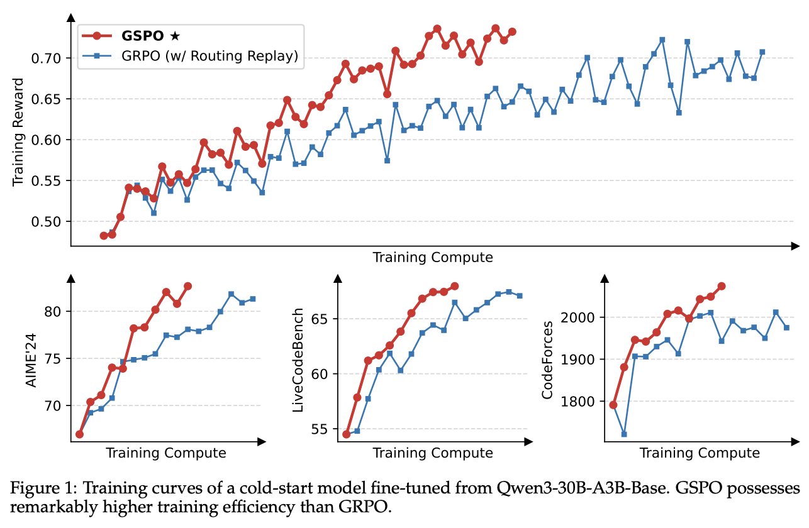
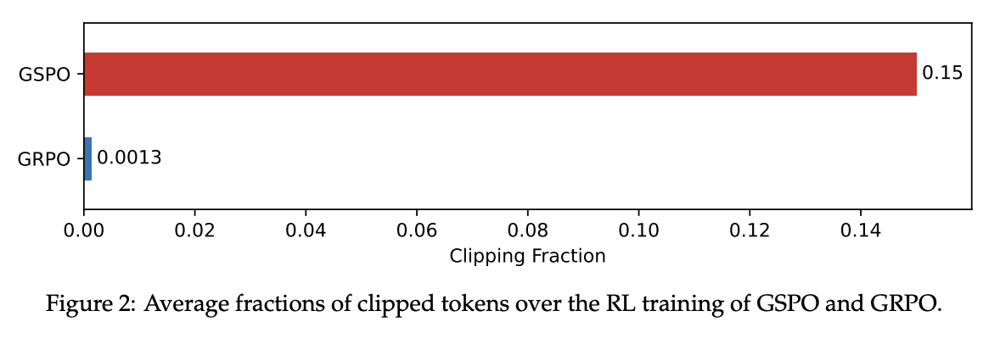
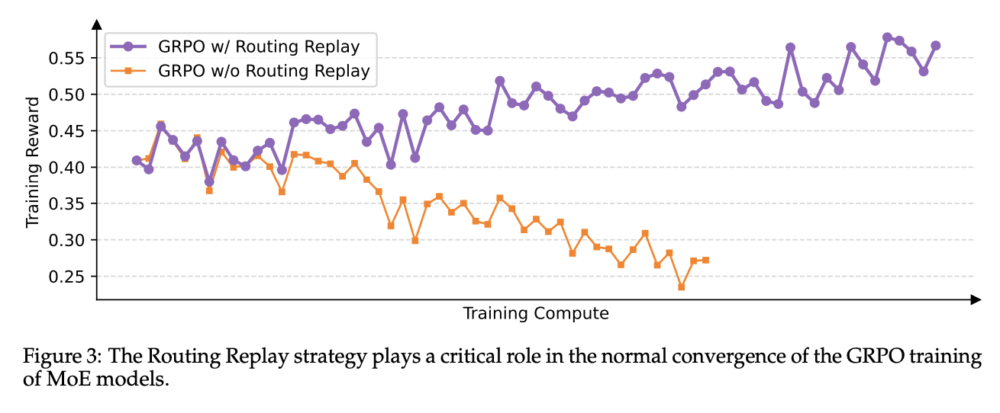

Qwen [just](https://x.com/Alibaba_Qwen/status/1949412072942612873) launched so called **breakthrough RL algorithm** and they are calling it  **Group Sequence Policy Optimization (GSPO)**. In the paper they published, they demonstrated that GSPO is not just an incremental update; it's a fundamental fix that leads to more stable, efficient, and powerful LLMs. 

I couldn't stop myself from reading this paper and share my learnings. So let's see how it really works!

Algorithms like Proximal Policy Optimization (PPO) and more recently, Group Relative Policy Optimization (GRPO), have been instrumental. However, as models are getting bigger and more complex day by day, these methods have started to show cracks, often leading to unstable training and catastrophic performance collapses.

## Quick recap

Before we get to GSPO, let's quickly **recap how modern RL for LLMs works**. It has evolved through several key stages:

1.  **PPO (Proximal Policy Optimization):** This was a major step. Instead of just using a fixed dataset, PPO uses a separate **reward model** (often trained on human feedback) to score the LLM's responses. The LLM is then trained to maximize these scores. This is powerful but complex, as it requires training and maintaining a whole separate model just for rewards.

2.  **DPO (Direct Policy Optimization):** DPO simplified things by getting rid of the reward model. Instead, it learns directly from human preferences (e.g., **Response B is better than Response A**). This is more direct but still relies heavily on collecting large amounts of human preference data.

3.  **GRPO (Group Relative Policy Optimization):** GRPO took another leap by often removing the need for human feedback altogether. It generates a *group* of responses and uses an automated "verifier" or reward function (like checking if code compiles or a math answer is correct) to score them. It then teaches the model to produce responses that score higher than the group average.

### The Problem with Rewarding Every Little Step

GRPO was a big improvement, but it has a hidden flaw. It operates at the **token level**. A "token" is a word or part of a word. GRPO analyzes the probability of *each individual token* in a response and adjusts the model's weights based on that.

::: {.callout-note title="Analogy"}

Imagine teaching a child to build a tower of blocks. The token-level approach is like praising them for *every single action*: "Good job picking up a block! Great placement! Excellent letting go!" This feedback is noisy and confusing. The child might focus on perfecting one tiny action rather than understanding the overall goal of building a stable tower.
:::

This is what happens with GRPO. The model can get lost in the noise of token-level feedback, leading to unstable training. The Qwen paper identifies this as a primary cause of the "irreversible model collapse" seen when training very large models.

## What is GSPO?

Group Sequence Policy Optimization (GSPO) fixes this fundamental problem by shifting from the token level to the **sequence level**.

So it almost turns into an optimization policy that **Rewards the Final Outcome**

Instead of rewarding every tiny step, GSPO waits for the entire task to be completed and then gives a single, holistic score for the final result.

To use our analogy: 

::: {.callout-note title="Analogy"}

GSPO waits for the child to finish building the block tower. Then, it looks at the whole tower and says, "This is a fantastic, stable tower! You get a big reward." The feedback is clearer, more meaningful, and directly tied to the ultimate goal.

:::

## How does GSPO Work?

The GSPO workflow is an elegant loop that focuses on clear, high-level feedback. Here’s how it works, step by step:

* **Step 1: Generate a Group of Responses.** For a single prompt (e.g., a math problem), the main model (the "Policy Model") generates a diverse group of potential answers. This is like brainstorming multiple ways to solve the problem.

* **Step 2: Score Each Complete Response.** This is the first key difference from GRPO. An automated reward function—like a script that checks if the final answer is correct or if code passes unit tests—evaluates each *entire* response and assigns it a single score. There's no judgment on individual words, only on the final outcome.

* **Step 3: Calculate the "Sequence Advantage".** GSPO takes all the scores from the group and calculates an "advantage" for each response. This advantage simply represents how much better or worse a given response was compared to the average of the group. We'll dive into this in the next section.

* **Step 4: Update the Model.** The model is updated based on this sequence-level advantage.
    * If a sequence has a **positive advantage** (it was better than average), the model's weights are adjusted to make generating that *entire sequence* more likely in the future.
    * If a sequence has a **negative advantage** (it was worse than average), the model is discouraged from producing that sequence.
    * A **KL Divergence** check with a frozen "Reference Model" ensures the model doesn't stray too far from its original capabilities, preventing it from "reward hacking" or forgetting how to write coherent text.

### From Group Scores to a Learning Signal

So how does GSPO create a learning signal from a bunch of scores? It's simpler than you might think and doesn't require a complex "Value Model" like older methods.

Let's say we give the model a math problem and it generates four different solutions. Our reward function scores them based on correctness:

* **Response A:** Correct reasoning, correct answer. **Score = 1.0**
* **Response B:** Correct reasoning, but a small calculation error. **Score = 0.5**
* **Response C:** Wrong reasoning, wrong answer. **Score = 0.0**
* **Response D:** Fails to follow formatting, wrong answer. **Score = 0.0**

1.  **Find the Average:** The average score for this group is (1.0 + 0.5 + 0.0 + 0.0) / 4 = **0.375**. This is our baseline for "average performance" on this specific problem.

2.  **Calculate the Advantage:** Now, GSPO compares each score to this average.
    * **Response A (1.0):** Is way above average. It gets a **strong positive advantage**.
    * **Response B (0.5):** Is slightly above average. It gets a **weak positive advantage**.
    * **Responses C & D (0.0):** Are below average. They get a **negative advantage**.

This "advantage" is the clean, simple signal used to teach the model. It tells the model exactly which complete lines of reasoning are worth learning from and which should be avoided, all relative to its current abilities.

## So, how good it is?

Qwen ran a head-to-head comparison between GSPO and a carefully tuned GRPO. The results, shown in Figure 1 from their paper, are unambiguous: GSPO is not only more stable but also significantly more efficient.

GSPO's reward curve climbing steadily while GRPO's is far more volatile. On difficult math and coding benchmarks, GSPO achieves significantly better results with the same amount of training compute.

But **why is it so much better?** The paper offers two fascinating insights that explain the performance gap.

First, GSPO it seemed to be doing better at identifying high-quality training data. During training, RL algorithms "clip" (ignore) data that is too different from what the model already knows to prevent instability. I used to think that using more data is better, but GSPO turns that assumption on its head. The paper reveals that GSPO clips over 100 times more data than GRPO.

This counter-intuitive result shows that GRPO's token-level view is so noisy it can't tell good data from bad. GSPO, with its holistic sequence-level view, can effectively identify and focus only on the most useful learning examples, making it vastly more efficient.

Second, GSPO inherently solves a major stability problem for powerful but notoriously difficult-to-train Mixture-of-Experts (MoE) models. With GRPO, the underlying "experts" being used can shift dramatically from one training step to the next, causing training to fail. The old solution was a complex workaround called "Routing Replay." GSPO makes this obsolete.

Because GSPO cares about the final sequence, it isn't thrown off by small changes in which experts are used for which tokens. This inherent robustness fundamentally solves the MoE stability problem.

## Qwen cooked!

Group Sequence Policy Optimization is cool, even though it sounds otherwise. I think it is a real deal. It represents a shift in thinking—from micromanaging the model's every step to judging its final performance. This change delivers a trifecta of benefits:

1.  **Superior Stability and Performance:** It provides a cleaner learning signal that prevents model collapse and leads to better results.
2.  **Unlocks MoE at Scale:** It solves a critical instability problem, making it feasible to apply RL to the largest and most powerful MoE architectures.
3.  **Greater Efficiency:** By being better at identifying high-quality data, it achieves more with less, saving valuable compute resources.

The remarkable improvements in the latest Qwen3 models are a direct result of this new algorithm. By providing a more robust and scalable foundation for reinforcement learning, GSPO is paving the way for the next generation of smarter, more capable, and more reliable AI.

PS: I took a little help from Gemini for quickly taking notes from the paper.